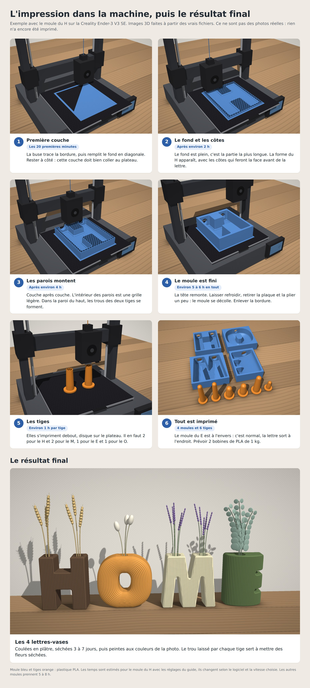

# Moules HOME : lettres-vases à côtes (impression 3D)

Moules rigides pour couler soi-même, en plâtre, les 4 lettres-vases H, O, M, E de l'annonce, aux tailles de la photo avec les mesures. H de 12 × 14,7 cm, O en beignet de 15 × 14,6 cm, M de 15 cm en bas et 12,5 cm en haut, avec la pointe du milieu posée au sol, E de 11 × 14,6 cm au devant bombé comme un cylindre. Pas besoin de silicone. Chaque moule est un bac imprimé en PLA, et la lettre est coulée face contre le fond.

---

## 1. Pour la personne qui imprime

### Fichiers à imprimer (dossier `stl/`)

| Fichier | Quantité | Taille (mm) | Rôle |
|---|---|---|---|
| `moule-H.stl` | 1 | 138 × 168 × 46 | moule du H |
| `moule-O.stl` | 1 | 168 × 167 × 45 | moule du O |
| `moule-M.stl` | 1 | 168 × 167 × 46 | moule du M |
| `moule-E.stl` | 1 | 128 × 167 × 46 | moule du E |
| `tige-H.stl` | 2 | Ø 40 × 109 | trous à fleurs du H, 24 mm |
| `tige-M.stl` | 2 | Ø 46 × 64 | trous à fleurs du M, 30 mm |
| `tige-E.stl` | 1 | Ø 46 × 99 | trou à fleurs du E, 30 mm |
| `tige-O.stl` | 1 | Ø 36 × 49 | trou à fleurs du O, 20 mm |

Pour couler une seule lettre à la fois, il suffit d'avoir les tiges de cette lettre. Une tige de rechange est utile.

### Réglages

- **Matière :** PLA (PETG possible). Compter environ 1,2 kg de filament pour le tout, soit 2 bobines de 1 kg : environ 250 g par moule et 120 g pour les 6 tiges.
- **Couches :** buse 0,4 mm, couches de 0,2 mm. Des couches de 0,12 à 0,16 mm donnent des côtes plus nettes.
- **Solidité :** 3 périmètres, 5 couches pleines dessus et dessous, remplissage 15 %.
- **Supports :** aucun. Une bordure (brim) de 5 mm est conseillée.
- **Orientation :** ne pas tourner les pièces, les fichiers sont déjà dans le bon sens. Les moules sont à plat, ouverture vers le haut. Les tiges sont debout, disque sur le plateau.
- **Plateau :** 17 × 17 cm minimum. Tous les moules passent sur une Ender-3 V3 SE, et même sur une imprimante à plateau de 18 cm.
- **Temps :** 3 à 8 h par moule selon l'imprimante, environ 1 h par tige.

### L'impression en images

Images 3D faites à partir des fichiers, avec le moule du H sur une Ender-3 V3 SE. Ce ne sont pas des photos réelles. Le fond plein du moule est la partie la plus longue à imprimer.

### Contrôle après impression

Chaque tige doit entrer dans son trou du moule, côté haut de la lettre, jusqu'au disque. Si c'est trop serré, poncer légèrement le trou ou la tige. Le haut des trous des parois peut s'affaisser un peu à l'impression : l'ébavurer au cutter.

---

## 2. Mode d'emploi du moulage en plâtre

**Matériel :** plâtre à mouler fin (plâtre de Paris ou plâtre céramique), vaseline, pinceau, seau, balance, règle plate, vieux chiffon.

1. **Graisser.** Passer une couche fine de vaseline, un peu diluée avec de l'huile, partout dans le moule et sur les tiges.
2. **Mettre les tiges.** Enfoncer chaque tige par l'extérieur du moule jusqu'au disque. Poser le moule sur une table bien horizontale.
3. **Gâcher.** Verser le plâtre dans l'eau, jamais l'inverse. Laisser tremper 1 minute, puis mélanger 2 minutes doucement, sans faire de bulles. Dose : 10 parts de plâtre pour 7 parts d'eau, au poids.
4. **Couler** jusqu'au bord. Tapoter le moule sur la table pendant 1 à 2 minutes pour faire remonter les bulles. Araser le dessus avec la règle.
5. **Retirer les tiges.** Quand le plâtre chauffe et devient ferme (20 à 40 minutes), tourner chaque tige d'un quart de tour et la tirer.
6. **Démouler.** Après 1 heure, retourner le moule sur un chiffon et tapoter le fond. La lettre sort. Ne jamais forcer avec un outil en métal.
7. **Sécher** 3 à 7 jours avant de peindre. Poncer légèrement les arêtes du dos.

### Le démoulage en images

Images 3D faites à partir des fichiers des moules. Ce ne sont pas des photos réelles.

### Si la lettre ne sort pas

1. Vérifier que toutes les tiges sont sorties.
2. Retourner le moule sur un chiffon plié et taper tout autour du fond et des bords avec un maillet en caoutchouc.
3. Souffler de l'air entre la paroi et le plâtre avec un compresseur ou une pompe à vélo.
4. Tremper le moule 5 minutes dans l'eau chaude du robinet, ou chauffer les parois au sèche-cheveux. Ne pas dépasser 55 °C.
5. En dernier recours, couper le moule et le réimprimer : la lettre est sauvée.

Pour éviter le problème : poncer l'intérieur des parois au papier fin (grain 240 à 400) et bien graisser. Les languettes fines du moule du M sont fragiles : démouler doucement.

### Quantités par lettre (10 % de marge comprise)

| Lettre | Volume | Plâtre | Eau | Poids sec environ |
|---|---|---|---|---|
| H | 0,54 L | 0,54 kg | 0,38 L | 0,6 kg |
| O | 0,70 L | 0,71 kg | 0,49 L | 0,8 kg |
| M | 0,67 L | 0,68 kg | 0,48 L | 0,75 kg |
| E | 0,54 L | 0,55 kg | 0,38 L | 0,6 kg |
| **Total** | **2,4 L** | **2,5 kg** | **1,7 L** | |

Prévoir un sac de 3 kg minimum, ou 5 kg pour avoir de quoi faire un essai.

**Couleurs comme sur la photo :** ajouter un peu de peinture acrylique ou de pigment dans l'eau avant de verser le plâtre, ou peindre après séchage avec une acrylique mate.

---

## 3. À savoir

- **Eau et fleurs fraîches :** le plâtre n'est pas étanche. Glisser un tube à essai en verre dans le trou, de 20 mm maximum pour le H, 25 mm pour le M et le E, 16 mm pour le O. Ou vernir l'intérieur. Pour des fleurs séchées ou artificielles, rien à faire.
- **Pas de résine époxy** dans ces moules. Elle chauffe, déforme le PLA et colle au plastique.
- **Béton possible** (ciment blanc et sable fin). Tourner les tiges toutes les heures pendant la prise, les retirer après 6 à 8 heures, démouler après 24 heures. Les lettres pèsent alors deux fois plus lourd.
- **Le E est inversé dans son moule.** C'est normal : la lettre est coulée face contre le fond, elle sort à l'endroit.
- **Le dos des lettres est plat.** C'est la face coulée à l'air libre. Les côtes sont sur la face avant.
- **Les côtés sont lisses.** Sur la photo, les côtes continuent sur les côtés. Un moule rigide ne permet pas ce détail : il faudrait un moule en silicone.

---

## 4. Caractéristiques

- **Lettres, face avant :** H 12 × 14,7 cm ; O 15 × 14,6 cm ; M 15 cm en bas, 12,5 cm en haut, 14,6 cm de haut ; E 11 × 14,6 cm. Le dos est 2 mm plus grand de chaque côté, à cause de la pente des parois.
- **Épaisseur :** 4,2 cm plus les côtes. La photo ne la donne pas, c'est un choix.
- **M :** jambes inclinées et pointe du milieu posée au sol, comme le M de McDo. Il tient sur trois appuis.
- **E :** de face, un bloc presque rectangulaire. Le devant est bombé comme un cylindre : il recule d'environ 2,4 cm sur les bords gauche et droit. Deux fentes fines de 12 mm, profondes de 2,9 cm.
- **Décor :** côtes verticales de 4 mm sur H, M et E. Le O a une face avant bombée en beignet, couverte de 13 anneaux.
- **Trous à fleurs :** H Ø 24 mm sur 9 cm, M Ø 30 mm sur 4,5 cm, E Ø 30 mm sur 8 cm, O Ø 20 mm sur 3 cm. Sur la photo, les ouvertures font 2,6 cm pour le H, 3,7 cm pour le M, et le O a une fente de 6 cm : ici les trous sont ronds, un peu plus petits, pour garder du plâtre solide autour.
- **Démoulage :** pente de 3° sur les parois tournées vers le haut et les côtés. Les faces tournées vers le bas, dont les bases, restent droites pour que les lettres tiennent bien debout.
- **Option sans plâtre :** le dossier `stl/option-lettres-directes/` contient les lettres elles-mêmes. On peut les imprimer directement en plastique, couchées sur le dos, sans support, puis les peindre.
- **Taille de l'imprimante :** voir `apercu/taille-imprimante.jpg` (Creality Ender-3 V3 SE avec le plus grand moule sur le plateau).

## 5. Modifier les dimensions

Le dossier `generateur/` contient le programme qui a créé ces fichiers (Node.js, sans dépendance). Les formes des lettres et les paramètres sont en haut de `moules.js`. La commande `node moules.js sortie` regénère les fichiers STL, `node apercu.js sortie` regénère les images, `node demoulage.js sortie` regénère les images du démoulage, et `node impression.js sortie` celles de l'impression et du résultat final.
