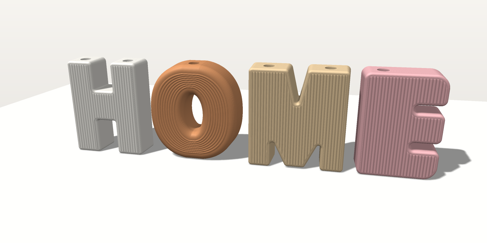
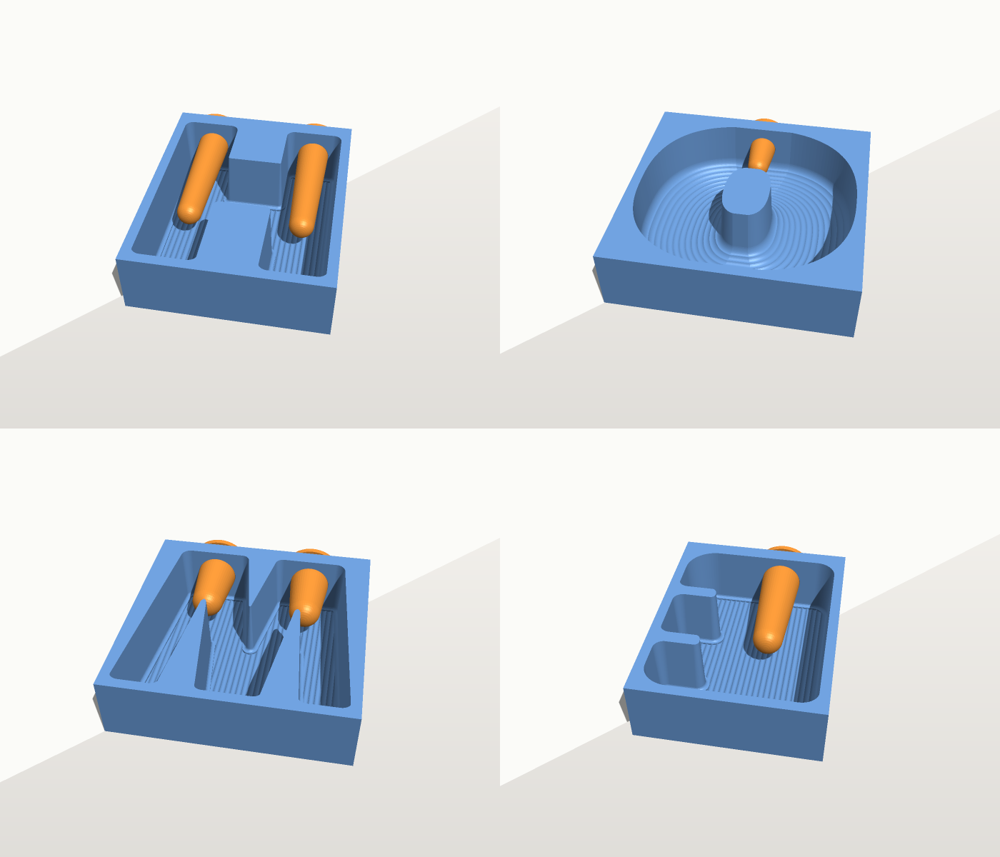
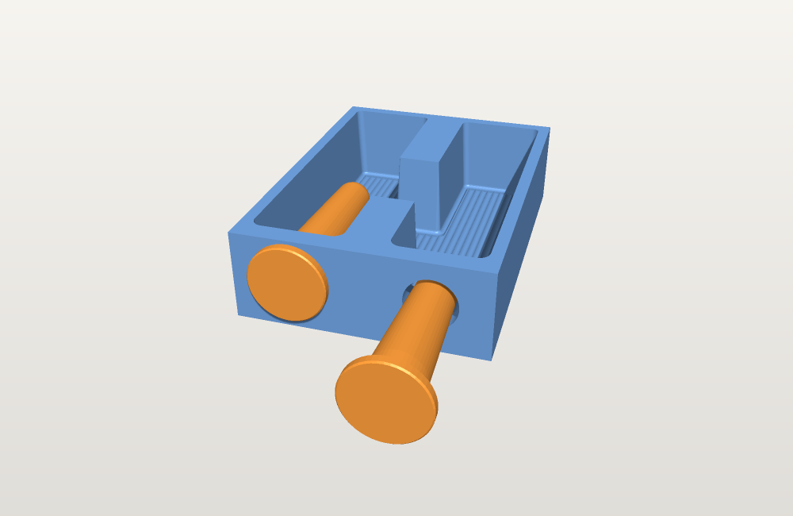
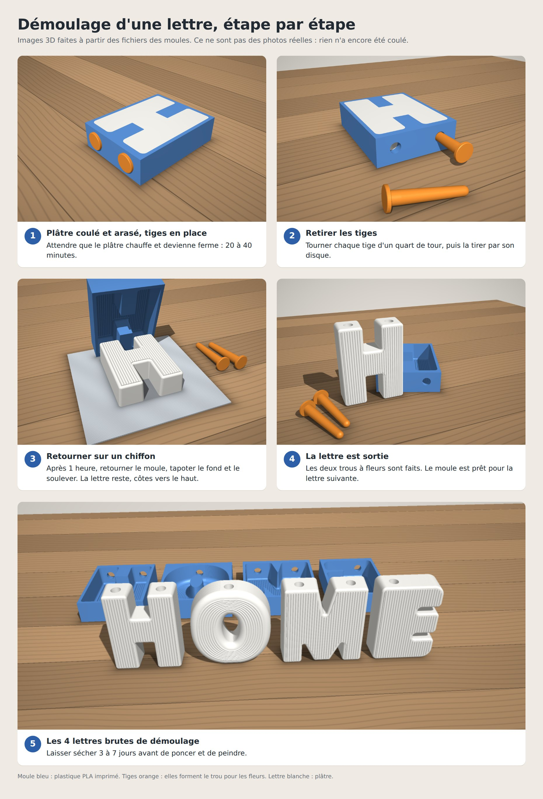
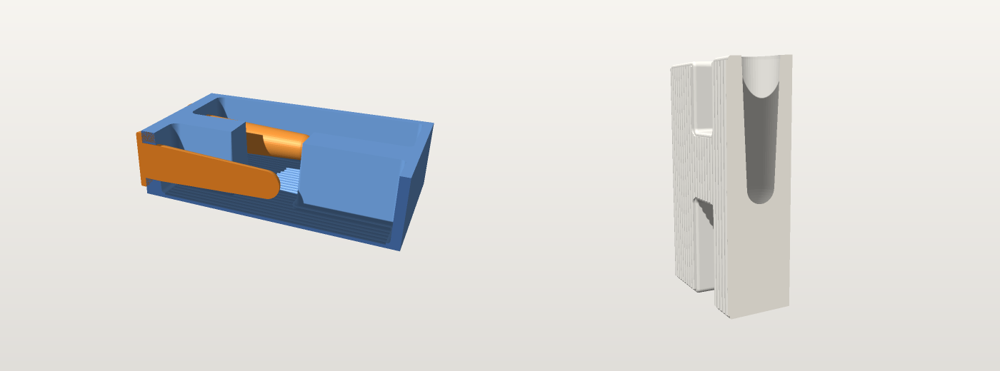

# Moules HOME : lettres-vases à côtes (impression 3D)

Moules rigides pour couler soi-même, en plâtre, les 4 lettres-vases H, O, M, E de la photo : style nordique à côtes, trou pour les fleurs sur le dessus. Pas besoin de silicone. Chaque moule est un bac imprimé en PLA, et la lettre est coulée face contre le fond.

---

## 1. Pour la personne qui imprime

### Fichiers à imprimer (dossier `stl/`)

| Fichier | Quantité | Taille (mm) | Rôle |
|---|---|---|---|
| `moule-H.stl` | 1 | 158 × 202 × 54 | moule du H |
| `moule-O.stl` | 1 | 185 × 202 × 54 | moule du O |
| `moule-M.stl` | 1 | 189 × 202 × 54 | moule du M |
| `moule-E.stl` | 1 | 149 × 202 × 54 | moule du E |
| `tige-longue.stl` | 5 | Ø 36 × 120 | fait le trou à fleurs : 2 pour le H, 2 pour le M, 1 pour le E |
| `tige-courte.stl` | 1 | Ø 36 × 56 | fait le trou à fleurs du O |

Pour couler une seule lettre à la fois, 2 tiges longues et 1 courte suffisent. Une tige de rechange est utile.

### Réglages

- **Matière :** PLA (PETG possible). Compter environ 1,5 kg de filament pour le tout.
- **Couches :** buse 0,4 mm, couches de 0,2 mm. Des couches de 0,12 à 0,16 mm donnent des côtes plus nettes.
- **Solidité :** 3 périmètres, 5 couches pleines dessus et dessous, remplissage 15 %.
- **Supports :** aucun. Une bordure (brim) de 5 mm est conseillée.
- **Orientation :** ne pas tourner les pièces, les fichiers sont déjà dans le bon sens. Les moules sont à plat, ouverture vers le haut. Les tiges sont debout, disque sur le plateau.
- **Plateau :** 19 × 21 cm minimum. Si le plateau est plus petit, réduire tous les fichiers, moules et tiges, du même pourcentage (par exemple 85 %).
- **Temps :** 5 à 13 h par moule selon l'imprimante, environ 1 h par tige.

### Contrôle après impression

La tige doit entrer dans le trou du moule, côté haut de la lettre, jusqu'au disque. Si c'est trop serré, poncer légèrement le trou ou la tige.

---

## 2. Mode d'emploi du moulage en plâtre

**Matériel :** plâtre à mouler fin (plâtre de Paris ou plâtre céramique), vaseline, pinceau, seau, balance, règle plate, vieux chiffon.

1. **Graisser.** Passer une couche fine de vaseline, un peu diluée avec de l'huile, partout dans le moule et sur les tiges.
2. **Mettre les tiges.** Enfoncer chaque tige par l'extérieur du moule jusqu'au disque. Poser le moule sur une table bien horizontale.
3. **Gâcher.** Verser le plâtre dans l'eau, jamais l'inverse. Laisser tremper 1 minute, puis mélanger 2 minutes doucement, sans faire de bulles. Dose : 10 parts de plâtre pour 7 parts d'eau, au poids.
4. **Couler** jusqu'au bord. Tapoter le moule sur la table pendant 1 à 2 minutes pour faire remonter les bulles. Araser le dessus avec la règle.
5. **Retirer les tiges.** Quand le plâtre chauffe et devient ferme (20 à 40 minutes), tourner chaque tige d'un quart de tour et la tirer.
6. **Démouler.** Après 1 heure, retourner le moule sur un chiffon et tapoter le fond. La lettre sort. Ne jamais forcer avec un outil en métal.
7. **Sécher** 3 à 7 jours avant de peindre. Poncer légèrement les arêtes du dos.

### Le démoulage en images

Images 3D faites à partir des fichiers des moules. Ce ne sont pas des photos réelles.

### Quantités par lettre (10 % de marge comprise)

| Lettre | Volume | Plâtre | Eau | Poids sec environ |
|---|---|---|---|---|
| H | 1,03 L | 1,05 kg | 0,73 L | 1,2 kg |
| O | 1,15 L | 1,17 kg | 0,82 L | 1,3 kg |
| M | 1,41 L | 1,43 kg | 1,00 L | 1,6 kg |
| E | 1,12 L | 1,14 kg | 0,80 L | 1,3 kg |
| **Total** | **4,7 L** | **4,8 kg** | **3,35 L** | |

Prévoir un sac de 5 kg minimum, ou 10 kg pour avoir de quoi faire un essai.

**Couleurs comme sur la photo :** ajouter un peu de peinture acrylique ou de pigment dans l'eau avant de verser le plâtre, ou peindre après séchage avec une acrylique mate.

---

## 3. À savoir

- **Eau et fleurs fraîches :** le plâtre n'est pas étanche. Glisser un tube à essai en verre de 18 mm maximum dans le trou, ou vernir l'intérieur. Pour des fleurs séchées ou artificielles, rien à faire.
- **Pas de résine époxy** dans ces moules. Elle chauffe, déforme le PLA et colle au plastique.
- **Béton possible** (ciment blanc et sable fin). Tourner les tiges toutes les heures pendant la prise, les retirer après 6 à 8 heures, démouler après 24 heures. Les lettres pèsent alors deux fois plus lourd.
- **Le E est inversé dans son moule.** C'est normal : la lettre est coulée face contre le fond, elle sort à l'endroit.
- **Le dos des lettres est plat.** C'est la face coulée à l'air libre. Les côtes sont sur la face avant.

---

## 4. Caractéristiques

- **Lettres :** 18 cm de haut, 5 cm d'épaisseur plus les côtes. Bords avant arrondis.
- **Décor :** côtes verticales de 5 mm sur H, M et E. Huit anneaux concentriques sur le O.
- **Trou à fleurs :** Ø 20 mm, 10 cm de profondeur (3,6 cm pour le O).
- **Démoulage :** dépouille de 3° sur les parois, sauf sous la base, pour que la lettre tienne bien droite.
- **Option sans plâtre :** le dossier `stl/option-lettres-directes/` contient les lettres elles-mêmes. On peut les imprimer directement en plastique, couchées sur le dos, sans support, puis les peindre.

## 5. Modifier les dimensions

Le dossier `generateur/` contient le programme qui a créé ces fichiers (Node.js, sans dépendance). Les paramètres sont en haut de `moules.js`. La commande `node moules.js sortie` regénère les fichiers STL, `node apercu.js sortie` regénère les images, et `node demoulage.js sortie` regénère les images du démoulage.
